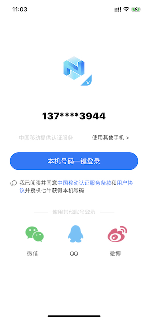
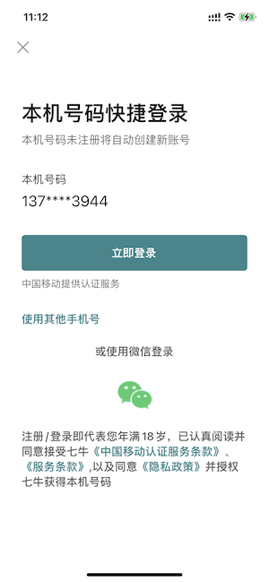
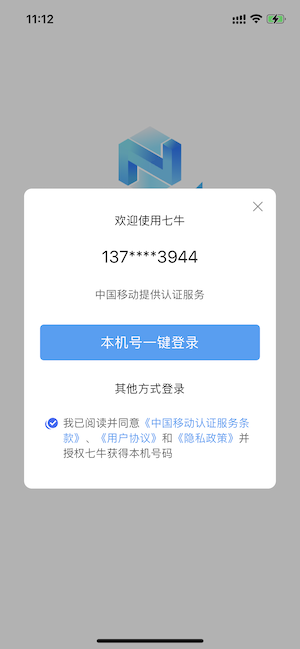
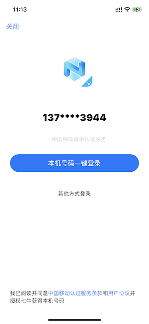

# iOS 快速集成文档
## 快速跑通demo
* 申请七牛一键登录appID
* 修改demo buildID, AppDelegate 中使用您申请的 appID、appKey
* 运行demo工程

## 本地集成
### 导入sdk
下载sdk:[framworks](https://github.com/pili-engineering/QAuth_iOS/tree/main/QAuth_iOS/frameworks

[),导入你的 iOS 工程

## 一键登录api

### 初始化
调用SDK其他流程方法前，请确保已调用过初始化，否则会返回未初始化。建议在application.onCeate() 中初始化。

示例代码
```objective-c
[QNAuthSDKManager initWithAppId:APPID appKey:APPKEY complete:^(QNCompleteResult * _Nonnull completeResult) {
 }];
```
方法原型
```objective-c
/// 初始化
/// @param appId            七牛后台申请的appId
/// @param complete         预初始化回调block（⚠️在子线程中回调）
+ (void)initWithAppId:(NSString *)appId appKey:(NSString *)appKey
             complete:(nullable QNComplete)complete
```
### 预取号
- **不建议 频繁的多次调用和在拉起授权页后调用**
- **预取号方法回调中处理UI操作需手动切换到主线程**
- **建议在执行一键登录的方法前，提前一段时间调用此方法**（比如调一键登录的 vc 的viewdidload 中，或者 rootVC 的 viewdidload 中，或者 app 启动后，此调用将有助于提高闪验拉起授权页的速度和流畅度）

方法原型
```java
/// 预取号
///此调用将有助于提高七牛拉起授权页的速度和成功率
///建议在一键登录前提前调用此方法，比如调一键登录的vc的viewdidload中
///不建议在拉起授权页后调用
///⚠️‼️以 if (completeResult.error == nil) 为判断成功的依据，而非返回码
/// @param complete         回调block（⚠️在子线程中回调）
+ (void)preGetPhonenumber:(nullable QNComplete)complete
```
当callback回调成功会获取到置换手机号所需的token。请参考「服务端」文档来实现获取手机号码的步骤

**接口作用**

**电信、联通、移动预取号** :初始化成功后，如果当前为电信/联通/移动，将调用预取号，可以提前获知当前用户的手机网络环境是否符合一键登录的使用条件，成功后将得到用于一键登录使用的临时凭证，默认的凭证有效期60min(三大运营商一致)。


### 其他 api

#### 清理预取号缓存
方法原型
```java
/// 清除预取号缓存
+ (void)clearScripCache;
```

#### 获取运营商类型
方法原型
```java
/// 获取当前流量卡运营商，结果仅供参考（CTCC：电信、CMCC：移动、CUCC：联通、UNKNOW：未知）
+ (NSString *)getOperatorType;
```

#### 设置预取号超时时间
方法原型
```objective-c
///**
// 设置初始化超时 单位:s
// 大于0有效
// 建议4s左右，默认4s
// */
//+ (void)setInitTimeOut:(NSTimeInterval)initTimeOut;

/// 设置预取号超时 单位:s（大于0有效；建议4s左右，默认4s）
/// @param preGetPhoneTimeOut 预取号超时时间
+ (void)setPreGetPhonenumberTimeOut:(NSTimeInterval)preGetPhoneTimeOut;
```

#### 拉起授权页

**在预取号成功后调用**，预取号失败不建议调用。调用拉起授权页方法后将会调起运营商授权页面。该方法会拉起登录界面，**已登录状态请勿调用 。**

```objectivec
/**
 一键登录 区分拉起授权页之前和之后的回调
 
 @param qnUIConfigure 闪验授权页参数配置
 @param openLoginAuthListener 拉起授权页监听：拉起授权页面成功或失败的回调，拉起成功或失败均触发。当拉起失败时，oneKeyLoginListener不会触发。此回调的内部触发时机是viewDidAppear
                    
 @param oneKeyLoginListener 一键登录监听：拉起授权页成功后的后续操作回调，包括点击SDK内置的(非外部自定义)取消登录按钮，以及点击本机号码一键登录的回调。点击授权页自定义按钮不触发此回调
 
 * 回调中如需UI操作，建议自行切到主线程
 */
+(void)quickAuthLoginWithConfigure:(QNUIConfigure *)clUIConfigure
             openLoginAuthListener:(QNComplete)openLoginAuthListener
               oneKeyLoginListener:(QNComplete)oneKeyLoginListener;
```

#### 关闭授权页面

```objective-c
/// 关闭授权页
///注：若授权页未拉起或已经提前关闭，此方法调用无效果，complete不触发。内部实现为调用系统方法dismissViewcontroller:Complete
/// @param flag             dismissViewcontroller`Animated, default is YES.
/// @param completion       dismissViewcontroller`completion（⚠️在子线程中回调）
+ (void)finishAuthControllerAnimated:(BOOL)flag
                          Completion:(void(^_Nullable)(void))completion;
```


## 授权页界面配置，自定义参考 demo ,参考演示有如下：











## 错误码

| sdk 错误码 | 返回码描述                                   |
| ---------- | -------------------------------------------- |
| 1000       | 一键登录成功，解析result，可得到网络请求参数 |
| 1011       | 用户取消免密登录（点击返回按钮）             |
| 1001       | SDK初始化失败                                |
| 1023       | 预取号/取号失败                              |
| 1003       | 拉起授权页失败/一键登录失败/获取token失败    |
| 1008       | 未开启移动网络                               |
| 1032       | 账户禁用                                     |
| 2000       | 本机校验：获取token成功                      |
| 2001       | 本机校验：手机号码为空                       |
| 2003       | 本机校验：联通获取token失败                  |
| 2004       | 本机校验：电信获取token失败                  |
| 2005       | 本机校验：移动获取token失败                  |
| 2009       | 本机校验：非三大运营商                       |
| 2023       | 本机校验：未开启移动网络                     |
| 其他       | 其他错误                                     |

移动
|返回码|返回码描述|
| - | - |
|103000|成功|
|102507|登录超时（授权页点登录按钮时）|
|103101|请求异常|
|103102|包签名错误（社区填写的appid和对应的包名包签名必须一致）|
|103111|错误的运营商请求（可能是用户正在使用代理或者运营商判断失败导致）|
|103119|appid不存在|
|103211|其他错误，联系技术支撑解决问题|
|103412|无效的请求（1.加密方式错误；2.非json格式；3.空请求等）|
|103414|参数校验异常|
|103511|服务器ip白名单校验失败|
|103811|token为空|
|103902|scrip失效（短时间内重复登录）|
|103911|token请求过于频繁，10分钟内获取token且未使用的数量不超过30个|
|104201|token已失效或不存在（重复校验或失效）|
|105001|联通取号失败|
|105002|移动取号失败|
|105003|电信取号失败|
|105012|不支持电信取号|
|105013|不支持联通取号|
|105018|token权限不足（使用了本机号码校验的token获取号码）|
|105019|应用未授权（未在开发者社区勾选能力）|
|105021|当天已达取号限额|
|105302|appid不在白名单|
|105312|余量不足（体验版到期或套餐用完）|
|105313|非法请求|
|200005|用户未授权（READ\_PHONE\_STATE）|
|200010|无法识别sim卡或没有sim卡（android）|
|200015|短信验证码格式错误|
|200020|用户取消登录|
|200021|数据解析异常|
|200022|无网络|
|200023|请求超时|
|200024|数据网络切换失败|
|200025|未知错误一般出现在线程捕获异常，请配合异常打印分析|
|200026|输入参数错误|
|200027|未开启数据网络或网络不稳定|
|200028|网络异常|
|200038|异网取号网络请求失败|
|200039|异网取号网关取号失败|
|200040|UI资源加载异常|
|200048|用户未安装sim卡|
|200050|EOF异常|
|200060|切换账号（未使用SDK短验时返回）|
|200072|CA根证书校验失败|
|200080|本机号码校验仅支持移动手机号|
|200082|服务器繁忙|
|200087|授权页成功调起|

联通
|**状态码（status）**|**信息（msg）**|**示例说明**|
| :-: | :-: | :-: |
|101001|授权码不能为空使用SDK|调用置换接口时没有填入授权码|
|101002|认证的手机号不能为空使用SDK|认证置换时没有填入需要认证的手机号码|
|101003|UiConfig|不能为空调用openActivity|
|101004|ApiKey 或PublicKey 不能为空|未进行初始化，调用SDKManager.init()进行初始化|
|101005|超时|超过了接入方设置的时间|
|101006|公钥出错|公钥错误，请核对配置的公钥是否与申请的公钥一致|
|101007|用户取消登录|免密登录时，进入授权页执行了返回操作|
|102001|选择流量通道失败|<p>取号功能必须使用流量访问，在wifi 和流量同时开启的情况下，</p><p>sdk 会选择使用流量进行访问，此返回码代表切换失败！（受不</p><p>同机型的影响）</p>|
|201001|操作频繁请稍后再试|超出10 分钟之内只能访问30 次的限制|
|302001|SDK 解密异常|服务端返回数据时sdk 会进行解密操作，如果解密出错则出现此错误|
|302002|网络访问异常sdk|网络请求异常|
|302003|服务端数据格式出错|服务端返回数据格式错误|
|10000|请求超时|移动网络复杂，超时时间设置过短时，容易发生超时错误。 建议超时时间设置的长一点，3秒以上。|
|10001|获取token失败，请先调用预取号接口||
|~~10002~~|~~服务响应解析异常~~|~~取号服务端返回的数据无法正常解析~~|
|10003|无法切换至数据网络|wifi和蜂窝数据网络都开启的情况下， 无法强制取号请求从蜂窝数据网络发出。|
|10004|数据网络未开启|检测到蜂窝数据网络没有开启。|
|~~10005~~|~~网络判断异常~~|~~在进行网络开通情况判断和切换过程中捕获的异常~~|
|10007|预取号过期|标准UI版本使用|
|~~10010~~|~~Http状态码是200，302之外的值~~|~~取号接口只处理200和302状态码，其他都作为失败处理。~~|
|10011|Https通讯抛出异常|取号接口用到的HttpsURLConnection通信抛出的异常|
|~~10012~~|~~200 但body为空~~||
|~~10013~~|~~跳转地址错误~~|~~基本不会发生~~|
|10021|初始化失败||
|~~10022~~|~~网络请求响应为空~~||
|10024|Http通讯抛出异常|取号接口用到的HttpURLConnection通信抛出的异常|
|10025|ios sdk用到的部分异常||
|10026|ios sdk用到的socket部分错误||
|100|应用未授权||
|101|应用秘钥错误|该应用秘钥即为client\_secret。<br>1\. 核对**应用秘钥**是否正确<br>2\. 联系客服详细处理|
|102|应用无效|1\. client\_id字段未传<br>2\. client\_id字段值错误|
|~~103~~|~~应用未授权该IP访问~~||
|104|应用访问次数不足||
|105|应用包名不正确|注册应用时填写的包名与实际包名不符，核对包名报备是否正确|
|106|应用状态非法|应用处于非正常状态|
|107|商户状态非法|商户处于非正常状态|
|108|商户请求次数超限额||
|200|tokenId无效||
|201|token已失效|登录接口token无效标识。<br>token即预取号获得的accessCode值，默认有效期**30min**且**单次有效**。<br>可能原因如下：<br>1\. 已过有效期；<br>2\. 已被消费；<br>3\. 使用不存在的token；<br>4\. 应用标识与token不匹配。例：用应用标识A获取token，而用应用标识B去消费|
|202|token未授权该应用访问||
|203|登录鉴权级别不满足接口鉴权要求||
|300|接口未开放||
|301|应用未授权访问该接口|client\_id无访问相关接口权限，联系客服详细处理|
|302|IP 未授权码访问该接口|核对client\_id所配**公网IP**是否正确|
|303|应用访问接口次数超日限额||
|400|请求参数为空||
|401|请求参数不完整|核对必填参数：<br>1\. 是否传值<br>2\. 字段名是否正确|
|402|请求参数非法|1\. timeStamp间隔时间太久<br>2\. 其他参数传了不可识别的值：请检查请求参数是否与接口文档相符|
|600|请求非法||
|1000|请求解析错误|服务端无法解析请求参数，请检查请求参数是否与接口文档相符|
|1001|请求已失效|请求时间戳与中国标准时间间隔太久。<br>处理建议：请使用中国标准时间|
|1002|验签失败|1\. 核对sign生成规则<br>2\. 核对调用生成sign的method<br>3\. 核对**公私钥**是否匹配|
|1003|授权码已过期|认证接口token失效标识。<br>token即预取号获得的accessCode值，默认有效期**30min**且**单次有效**。<br>可能原因如下：<br>1\. 已过有效期；<br>2\. 已被消费；<br>3\. 使用不存在的token；<br>4\. 应用标识与token不匹配。例：用应用标识A获取token，而用应用标识B去消费|
|1004|加密方式不支持||
|1005|RSA加密错误||
|1010|服务间访问失败||
|1011|服务间访问错误|系统内部访问，未得到正确结果，联系客服详细处理。|
|~~2004~~|~~用户不存在~~||
|~~3002~~|~~跳转异网取号~~||
|~~3003~~|~~本网执行取号失败,不需要重定向~~||
|~~3004~~|~~NET取号失败~~||
|~~3005~~|~~上网方式为WIFI，无法取号~~||
|~~3006~~|~~urlencode编码失败~~||
|~~3007~~|~~请求认证接口异常~~||
|~~3009~~|~~非联通号码~~||
|3010|网关取号错误||
|3011|源IP鉴权失败|1\. 当前非联通数据网络<br>2\. APN为3gwap，目前仅支持3gnet<br>3\. 物联网卡|
|3012|网关取号失败|服务内部错误，联系客服详细处理|
|3013|电信网关取号失败||
|3014|电信网关取号错误||
|3015|回调消息缓存已失效||
|3016|移动网关取号失败||
|3017|移动网关取号错误||
|3018|生成授权码失败||
|3032|APPID不存在||
|3050|取号网关内部错误||
|3051|公网IP校验错误|1\. 当前非联通数据网络<br>2\. APN为3gwap，目前仅支持3gnet<br>3\. 物联网卡|
|3052|公网IP无法找到对应省份||
|~~3053~~|~~公网IP省份编码与输入不符~~||
|3054|私网IP校验错误||
|3055|私网IP查找号码失败||
|3056|省份暂不支持取号||
|3057|网关鉴权码查找号码失败||
|3058|网关鉴权码格式错误||
|3059|网关鉴权码已失效||
|3060|网关账号认证失败||
|3061|网关取号配额不足||
|3062|IP未授权访问网关||
|3063|网关并发连接数受限||
|3064|访问网关参数非法||
|3065|未授权访问该网关能力||
|3066|网关服务暂时不可用||

电信
|错误码|含义|
| :-: | :-: |
|0|请求成功|
|-64|permission-denied(无权限访问)|
|-65|API-request-rates-Exceed-Limitations(调用接口超限)|
|-10001|取号失败|
|-10002|参数错误|
|-10003|解密失败|
|-10004|ip受限|
|-10005|异网取号回调参数异常|
|-10006|Mdn取号失败，且属于电信网络|
|-10007|重定向到异网取号|
|-10008|超过预设取号阈值|
|-10009|时间戳过期|
|-20005|sign-invalid(签名错误）|
|-20006|应用不存在|
|-20007|公钥数据不存在|
|-20100|内部解析错误|
|-20102|加密参数解析失败|
|-30001|时间戳非法|
|-30003|topClass失效，请查看5.3+5.4常见问题。|
|51002|参数为空|
|51114|无法获取手机号数据|
|80000|请求超时|
|80001|请求网络异常|
|80002|响应码错误|
|80003|无网络连接|
|80004|移动网络未开启|
|80005|Socket超时异常|
|80006|域名解析异常|
|80007|IO异常|
|80008|No route to host|
|80009|nodename nor servname provided, or not known|
|80010|Socket closed by remote peer|
|80100|登录结果为空|
|80101|登录结果异常|
|80102|预登录异常|
|80103|SDK未初始化|
|80104|未调用预登录接口|
|80105|加载nib文件异常|
|80200|用户关闭界面|
|80201|其他登录方式|
|80800|WIFI切换异常|
|80801|WIFI切换超时|


